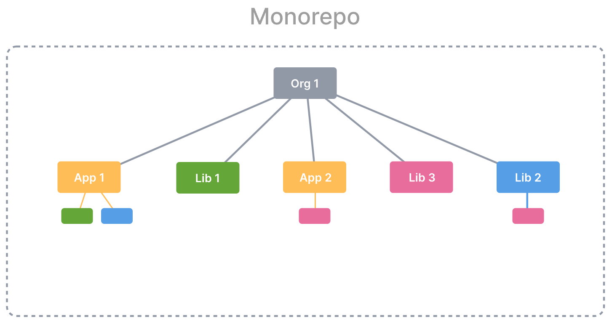
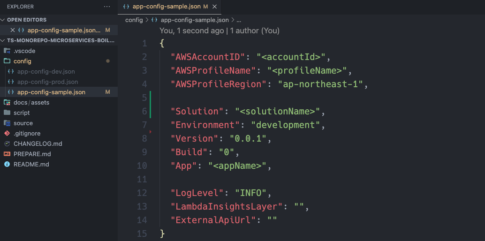
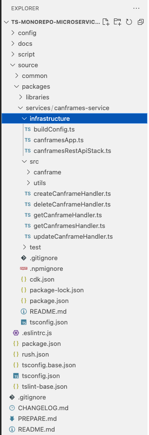

# Monorepo Microservices Boilerplate

This is microservices boilerplate for monorepo with CDK and Rush.

- CDK is used for producing CloudFormation output and microservice deployments
- Rush.js is used for managing dependencies and compiling multiple business service repos




## 1. Get started

### 1.1. Clone the boilerplate repo from Github

```bash
  $git clone https://github.com/hanhdt/ts-microservices-rush-boilerplate.git
```

### 1.2. Rename the boilerplate repo to your own repo name

## 2. Prerequisites

- see PREPARE.md

### AWS Account & IAM User

First of all, AWS Account and IAM User is required. IAM user's credential keys also are required.

### Dependencies

To execute this template codes, the following modules must be installed.

- AWS CLI: aws --version

- Node.js: node --version

- AWS CDK: cdk --version

- Rush: rush --version

## 3. Setup target environment configuration (for example: dev)



Because we need to ensure that a single source code is maintained, all configurations are managed in config/app-config-[your-suffix].json. And several files are made according to the environment you want to deploy to, and you have to choose one of them when deploying.
For example, if you want to deploy to dev environment, you have to create `config/app-config-dev.json`

- reference to config/app-config-sample.json

## 4. Initial setup and bootstrap

Execute the following command:

```bash
  $./script/initial_setup.sh config/app-config-dev.json
```

## 5. Init a new service repo (for example: sample-service)



To create new service repository, do the following step:

- Change `App` to your new `service-folder` name in `config/app-config-[environment].json`

- Execute the following command:

  ```bash
    $./script/create_new_service.sh config/app-config-dev.json <service-folder>
  ```

- Rename `@hanhdt/sample-service` in `package.json` to your new `service-name`

## 6. Deploy procedure

To deploy stacks, run the following commands:

```bash
  $./script/deploy_stacks.sh config/app-config-dev.json
```

Read more details about adding Rush configuration at `script/README.md`

## 7. Local Test

- see source/package/services/sample-service/README.md

## Appendixes

### Fix error: "SSM parameter /cdk-bootstrap/hnb659fds/version not found" in the Step 7

```bash
  $cd source/packages/services/<appName>
  $cdk deploy --no-previous-parameters -c config=dev
```

### Create local configuration file

The `.env` file will be placed at the service folder.
And it is scoped to the service.

You can put `.env` file in the `source/packages/services/<ServiceName>/config` folder.

```bash
  $cd source/packages/services/<ServiceName>/config
  $touch .env
```
