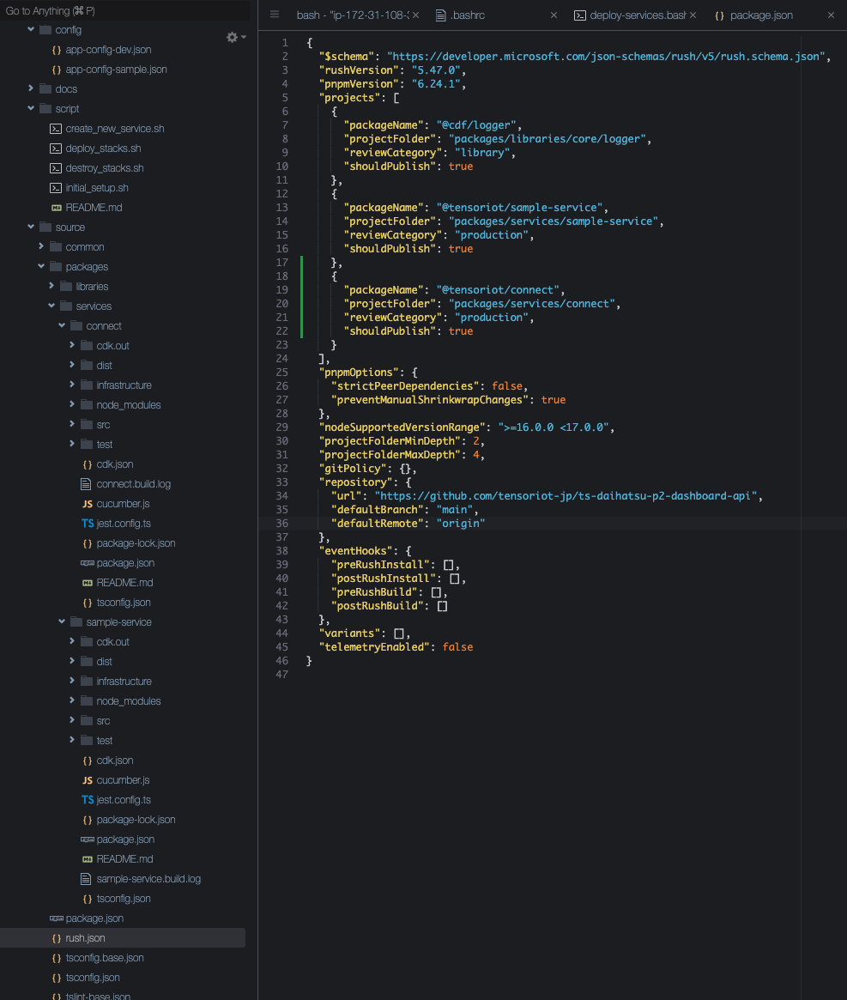

# Deployment services

## 1. Update Rush configuration files

Add your service project to

* source/rush.json
* source/common/config/rush/deploy.json



## 1. Quick deploy

This script will deploy all services under `source/packages/services` folder and its infrastructure to AWS.

```sh
$cd ~/ts-monorepo-microservices-boilerplate
$chmod +x ./deployment/*.sh
$./deployment/deploy_stacks.sh config/app-config-dev.json
```

## 2. Single service deploy

If you want to deploy a single service, you can use the following command.

```sh
$cd ~/source/packages/services/sample-service
$npm run deploy:[dev|prod]
```

## 3. Confirm deployed services

```sh
$ curl --location --request GET 'https://x6wlyex6pg.execute-api.ap-northeast-1.amazonaws.com/prod/canframes/?sort=asc' --header 'Accept: application/vnd.aws-cdf-v1.0+json' --header 'Content-Type: application/vnd.aws-cdf-v1.0+json' --header 'Content-Type: text/plain'
{"canframemodels":[{"year":"2023","model":"sample1-01"},{"year":"2023","model":"sample1-02"}]}


$ curl --location --request GET 'https://wnsjf6x03g.execute-api.ap-northeast-1.amazonaws.com/prod/canframes/?sort=asc' --header 'Accept: application/vnd.aws-cdf-v1.0+json' --header 'Content-Type: application/vnd.aws-cdf-v1.0+json' --header 'Content-Type: text/plain'
{"canframemodels":[{"year":"2023","model":"sample2-01"},{"year":"2023","model":"sample2-02"}]}
```

## 4. Destroy all services

```sh
$cd ~/ts-monorepo-microservices-boilerplate
$chmod +x ./deployment/*.sh
$./script/destroy_stacks.sh config/app-config-dev.json
```
